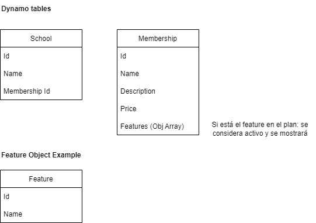

# Apis de eduqy

## Estructura de directorios donde estas los diferentes servicios:

### src

#### general

  - common
    - Schemas: Esquemas de validación json
    - Utils: otros módulos compartidos

#### memberships

  - common
    - Models: Entidades y queries
    - Schemas: Esquemas de validación json
  - functions: Funciones lambdas

#### schools

  - common
    - Models: Entidades y queries
    - Schemas: Esquemas de validación json
  - functions: Funciones lambdas

#### helpers

  - common
    - Models: Entidades y queries
    - Schemas: Esquemas de validación json
  - functions: Funciones lambdas

## Endpoints:

### helpers

  - POST /helpers
    - Create helper.
  - GET /helpers/{userType}
    - Get helper by user type

### memberships

  - POST /memberships
    - Create membership.
  - GET /memberships
    - Get memberships
  - PATCH /memberships/{id}
    - Update membership

### schools

  - POST /schools
    - Create school.
  - GET /schools/{id}
    - Get membership
  - PATCH /schools/{id}
    - Update membership

## Diagrama NoSQL

